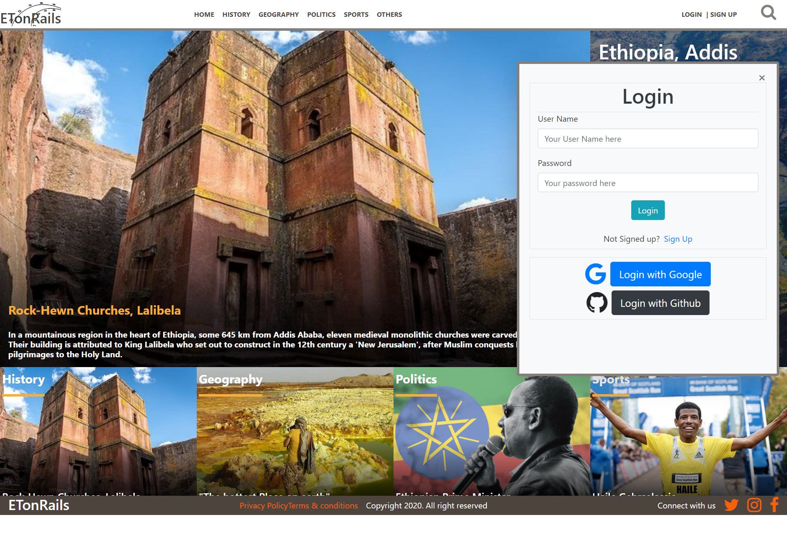
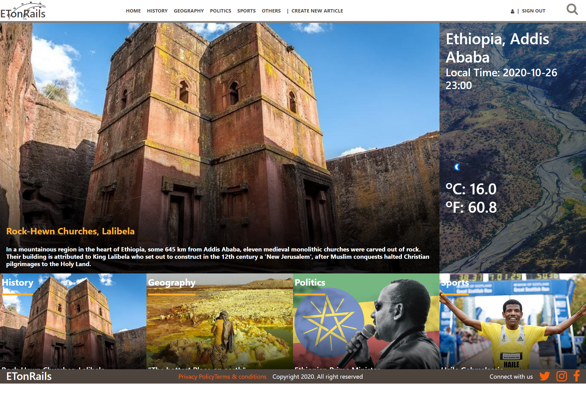
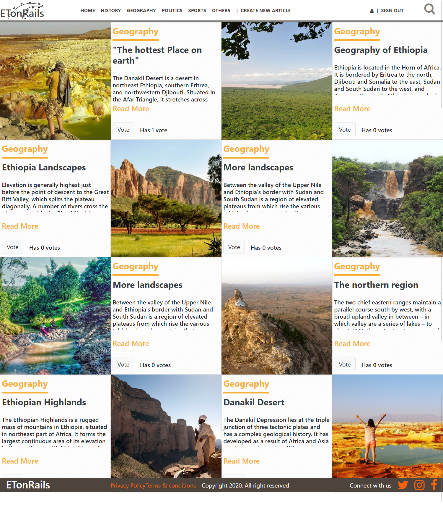

# Ethiopia on Rails, Articles Web App About Ethiopia

> This is a Ruby on Rails Capstone project in Microverse's rails curriculum, to build a Ruby on Rails application where people can write articles. Find the project description [here](https://www.notion.so/Lifestyle-articles-b82a5f10122b4cec924cd5d4a6cf7561#55d51338627b42bd95d86e2d1e58f105).

> This website is created to allow users to view, create, update, and store articles and images about the country Ethiopia. It has several other functionalities like login through Github and Google, see the current weather in Ethiopia, search an article and view articles by the current user.

[![Contributors][contributors-shield]][contributors-url]
[![Forks][forks-shield]][forks-url]
[![Stargazers][stars-shield]][stars-url]
[![Issues][issues-shield]][issues-url]
[![License: MIT][license-shield]][license-url]

# See the Live version here - > [Live Link](https://et-on-rails.herokuapp.com/)

### Sign up Interface


### Index Page


### Categories Page


# Built With

- Ruby v2.7.0
- Ruby on Rails v6.0.3
- HTML
- CSS
- Bootstrap
- Carrierwave
- Cloudinary
- Omniauth
- Rspec
- Capybara
- Bcrypt
- Rubocop

# Features
- Login or sign up with Google, Github or directly with the web app
- Access the available categories
- Search for articles
- Access articles created by the logged in user
- Access individual article to read more
- See who wrote the article and when
- Vote for Articles
- Edit articles
- See the highest voted article in the index page

# Prerequisites

- Ruby: 2.6.3
- Rails: 5.2.3
- Postgres: >=9.5

# Getting Started

### Get a local copy

`$ git clone https://github.com/Berabjesus/Ethiopia-on-Rails.git`

### Initial Setup

- Go to the local repo and run `bundle install`
- Updaate your yarn if its out of date with `yarn install --check-files`
- Install bootstrap with ```yarn add bootstrap jquery popper.js```

### Database Setup:
- First run `rails db:create`
- Then run `rails db:migrate`

### Start server:
- Run `rails server`

- Go to `http://localhost:3000/`

-  Login with github and google will only work in the live version because the api keys are not available publicly.


# Run tests
- Run `rails db:migrate RAILS_ENV=test`

- Run  ```bundle exec rspec ``` to run the tests.


# Author

👤 **Bereket Beshane**

- Github: [@berabjesus](https://github.com/Berabjesus)
- Twitter: [@bereket_ababu_b](https://twitter.com/bereket_ababu_b)
- Linkedin: [linkedin](https://www.linkedin.com/in/bereket-beshane-a1b75a1a9/)


## 🤝 Contributing

Contributions, issues and feature requests are welcome!

Feel free to check the [issues page](https://github.com/Berabjesus/ror-social-scaffold/issues).

## Show your support

Give a ⭐️ if you like this project!

## Acknowledgments

- Microverse
- Heroku
- Nelson Sakwa, The designer of the [Lifestyle Articles](https://www.behance.net/gallery/14554909/liFEsTlye-Mobile-version)

## 📝 License

None


[contributors-shield]: https://img.shields.io/github/contributors/Berabjesus/Ethiopia-on-Rails
[contributors-url]: https://github.com/Berabjesus/Ethiopia-on-Rails/contributors
[forks-shield]: https://img.shields.io/github/forks/Berabjesus/Ethiopia-on-Rails
[forks-url]:https://github.com/Berabjesus/Ethiopia-on-Rails/network/members
[stars-shield]: https://img.shields.io/github/stars/Berabjesus/Ethiopia-on-Rails
[stars-url]: https://github.com/Berabjesus/Ethiopia-on-Rails/stargazers
[issues-shield]: https://img.shields.io/github/issues/Berabjesus/Ethiopia-on-Rails
[issues-url]: https://github.com/Berabjesus/Ethiopia-on-Rails/issues
[license-shield]: https://img.shields.io/badge/License-MIT-yellow.svg
[license-url]: https://github.com/Berabjesus/Ethiopia-on-Rails/development/LICENSE
